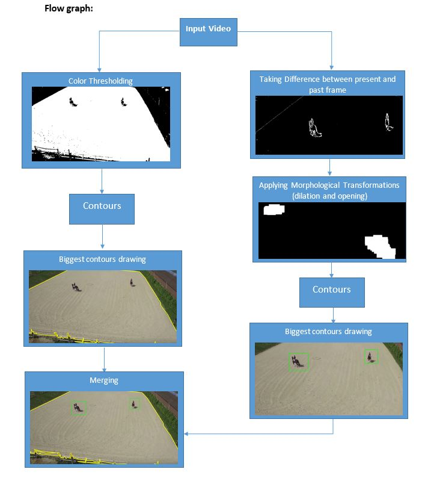

# Horse-and-Field-Detection-based-on-color-and-motion
The main task of this project is to detect the horse based on computer vision techniques. We have used different methods to find where the horse in field and finding the boundary of of barn area. The steps that are used in the code are explained below:

## Horse Detection: 

For detecting horse in the field we have used motion based technique, actually we are finding the difference between current frame and previous frame. If something moved in current frame from previous frame then there will be difference in pixels’ values, otherwise the area are objects are still on some place there will no difference. The image below shown the difference between 2 frames. 

As the prominent moving characters are horses in the field. After that we applied Morphological Transformations to remove small error points and small pixels and by this only major change remained.
------------------------------------------------------------------------------------------------------------------------------------------

### Morphological Transformations details:

Morphological transformations are some simple operations based on the image shape. It is normally performed on binary images. It needs two inputs, one is our original image, second one is called structuring element or kernel which decides the nature of operation. Two basic morphological operators are Erosion and Dilation. Then its variant forms like Opening, Closing, Gradient etc. also comes into play. We will see them one-by-one with help of following image:

The more details can be checked here in this [link](https://opencv-python-tutroals.readthedocs.io/en/latest/py_tutorials/py_imgproc/py_morphological_ops/py_morphological_ops.html)

After applying consecutive dilation and opening we have output shown below:

                              The only two horses remained other short noise removed.
                              
                              
We find connected component in the image contour/ blob. The Contours can be explained simply as a curve joining all the continuous points (along the boundary), having same color or intensity. The contours are a useful tool for shape analysis and object detection and recognition. Then we draw rectangle on that contour area the output shown below:

## Barn Field Detection:

As it can be observed that barn field is quite different than other object in terms of color. So we are using color range for barn detection. We used this website for detecting [https://imagecolorpicker.com/](https://imagecolorpicker.com/) the color of barn field and choose a range from min BGR (100, 100, 100) to upper range BGR (180, 200, 200). After applying threshold on this we have the output shown below:

After that we have found the biggest connected area and draw the contours boundary around it, the output shown below:

After joining the two process together we have final results shown below:

## Flow Graph:

## Tested Platform:
        Windows 10/Anaconda 3
        Python version: 3.6.5
        Compiler: jupyter Notebook 

Required Libraries:
        
        opencv: 		cv2.__version__>	3.4.3
        numpy:			np.__version__>		1.14.5
        
     Place the video in the same directory or add the path. Because of motion of camera there is also noice motion detection that was
     removed using erode and dilation techniques. Video has been croped to avoid environment disturbance.

